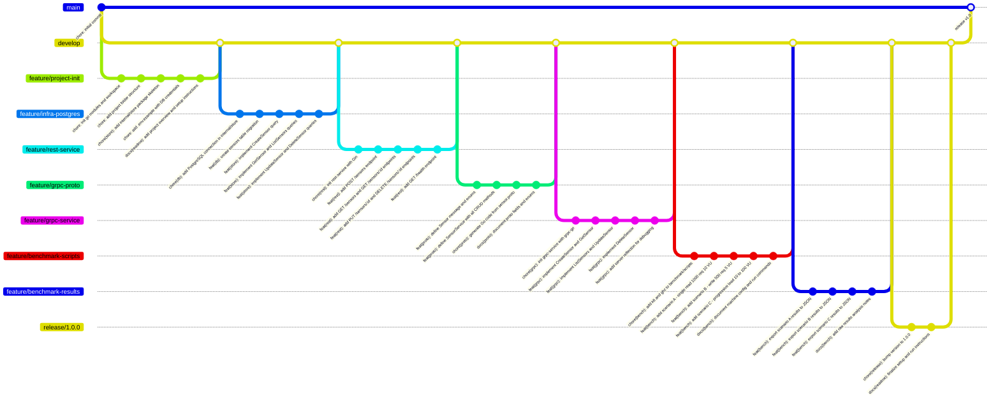

# 🗺️ Roadmap v1.0 — BenchLab

```mermaid
gitGraph LR:
   commit id: "chore: initial commit"

   branch develop
   checkout develop

   branch feature/project-init
   checkout feature/project-init
   commit id: "chore: init go modules and workspace"
   commit id: "chore: add project folder structure"
   commit id: "chore(store): add internal/store package skeleton"
   commit id: "chore: add .env.example with DB credentials"
   commit id: "docs(readme): add project overview and setup instructions"
   checkout develop
   merge feature/project-init

   branch feature/infra-postgres
   checkout feature/infra-postgres
   commit id: "chore(db): add PostgreSQL connection in internal/store"
   commit id: "feat(db): create sensors table migration"
   commit id: "feat(store): implement CreateSensor query"
   commit id: "feat(store): implement GetSensor and ListSensors queries"
   commit id: "feat(store): implement UpdateSensor and DeleteSensor queries"
   checkout develop
   merge feature/infra-postgres

   branch feature/rest-service
   checkout feature/rest-service
   commit id: "chore(rest): init rest-service with Gin"
   commit id: "feat(rest): add POST /sensors endpoint"
   commit id: "feat(rest): add GET /sensors and GET /sensors/:id endpoints"
   commit id: "feat(rest): add PUT /sensors/:id and DELETE /sensors/:id endpoints"
   commit id: "feat(rest): add GET /health endpoint"
   checkout develop
   merge feature/rest-service

   branch feature/grpc-proto
   checkout feature/grpc-proto
   commit id: "feat(proto): define Sensor message and enums"
   commit id: "feat(proto): define SensorService with all CRUD methods"
   commit id: "chore(proto): generate Go code from sensor.proto"
   commit id: "docs(proto): document proto fields and enums"
   checkout develop
   merge feature/grpc-proto

   branch feature/grpc-service
   checkout feature/grpc-service
   commit id: "chore(grpc): init grpc-service with grpc-go"
   commit id: "feat(grpc): implement CreateSensor and GetSensor"
   commit id: "feat(grpc): implement ListSensors and UpdateSensor"
   commit id: "feat(grpc): implement DeleteSensor"
   commit id: "feat(grpc): add server reflection for debugging"
   checkout develop
   merge feature/grpc-service

   branch feature/benchmark-scripts
   checkout feature/benchmark-scripts
   commit id: "chore(bench): add k6 and ghz to benchmark/scripts"
   commit id: "feat(bench): add scenario A - single read 1000 req 10 VU"
   commit id: "feat(bench): add scenario B - write 500 req 5 VU"
   commit id: "feat(bench): add scenario C - progressive load 10 to 100 VU"
   commit id: "docs(bench): document machine config and run commands"
   checkout develop
   merge feature/benchmark-scripts

   branch feature/benchmark-results
   checkout feature/benchmark-results
   commit id: "feat(bench): export scenario A results to JSON"
   commit id: "feat(bench): export scenario B results to JSON"
   commit id: "feat(bench): export scenario C results to JSON"
   commit id: "docs(bench): add raw results analysis notes"
   checkout develop
   merge feature/benchmark-results

   branch release/1.0.0
   checkout release/1.0.0
   commit id: "chore(release): bump version to 1.0.0"
   commit id: "docs(readme): finalize setup and run instructions"
   checkout develop
   merge release/1.0.0

  checkout main
   merge develop id: "release v1.0"
```
