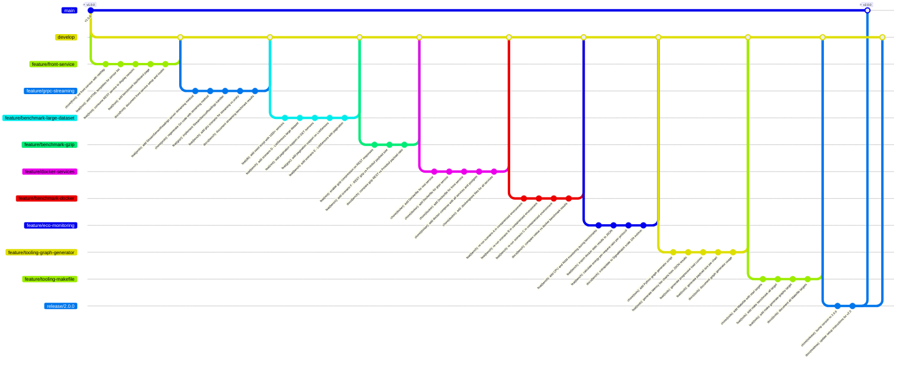

# 🗺️ Roadmap v2.0 — BenchLab (Bonus)

> Part depuis le tag `v1.0.0` — toutes les branches sont créées depuis `develop`

```mermaid
gitGraph LR:
   commit id: "v1.0.0" tag: "v1.0.0"

   branch develop
   checkout develop

   branch feature/front-service
   checkout feature/front-service
   commit id: "chore(front): init front-service with net/http"
   commit id: "feat(front): add HTML templates for sensor list"
   commit id: "feat(front): consume REST service to display sensors"
   commit id: "feat(front): add benchmark dashboard page"
   commit id: "docs(front): document front-service setup and routes"
   checkout develop
   merge feature/front-service

   branch feature/grpc-streaming
   checkout feature/grpc-streaming
   commit id: "feat(proto): add StreamSensorReadings server-streaming method"
   commit id: "chore(proto): regenerate Go code with streaming method"
   commit id: "feat(grpc): implement StreamSensorReadings handler"
   commit id: "feat(bench): add ghz scenario for streaming vs unary"
   commit id: "docs(bench): document streaming benchmark results"
   checkout develop
   merge feature/grpc-streaming

   branch feature/benchmark-large-dataset
   checkout feature/benchmark-large-dataset
   commit id: "feat(db): add seed script with 1000+ sensors"
   commit id: "feat(bench): add scenario D - ListSensors large dataset"
   commit id: "feat(rest): add pagination support on GET /sensors"
   commit id: "feat(grpc): add pagination support on ListSensors"
   commit id: "feat(bench): add scenario E - ListSensors with pagination"
   checkout develop
   merge feature/benchmark-large-dataset

   branch feature/benchmark-gzip
   checkout feature/benchmark-gzip
   commit id: "feat(rest): enable gzip compression on REST responses"
   commit id: "feat(bench): add scenario F - REST gzip vs Protobuf payload size"
   commit id: "docs(bench): compare gzip REST vs Protobuf payload ratio"
   checkout develop
   merge feature/benchmark-gzip

   branch feature/docker-services
   checkout feature/docker-services
   commit id: "chore(docker): add Dockerfile for rest-service"
   commit id: "chore(docker): add Dockerfile for grpc-service"
   commit id: "chore(docker): add Dockerfile for front-service"
   commit id: "chore(docker): add docker-compose with all services and postgres"
   commit id: "chore(docker): add .dockerignore files for all services"
   checkout develop
   merge feature/docker-services

   branch feature/benchmark-docker
   checkout feature/benchmark-docker
   commit id: "feat(bench): re-run scenario A in containerized environment"
   commit id: "feat(bench): re-run scenario B in containerized environment"
   commit id: "feat(bench): re-run scenario C in containerized environment"
   commit id: "docs(bench): compare native vs docker benchmark results"
   checkout develop
   merge feature/benchmark-docker

   branch feature/eco-monitoring
   checkout feature/eco-monitoring
   commit id: "feat(bench): add CPU and RAM monitoring during benchmarks"
   commit id: "feat(bench): export docker stats results to JSON"
   commit id: "feat(bench): calculate energy-per-request ratio per protocol"
   commit id: "docs(bench): extrapolate to SignalWatch scale 10k evt/min"
   checkout develop
   merge feature/eco-monitoring

   branch feature/tooling-graph-generator
   checkout feature/tooling-graph-generator
   commit id: "chore(tools): add Python graph generator script"
   commit id: "feat(tools): generate latency bar charts from JSON results"
   commit id: "feat(tools): generate progressive load curves"
   commit id: "feat(tools): generate payload size pie chart"
   commit id: "docs(tools): document graph generator usage"
   checkout develop
   merge feature/tooling-graph-generator

   branch feature/tooling-makefile
   checkout feature/tooling-makefile
   commit id: "chore(tools): add Makefile with start targets"
   commit id: "feat(tools): add make benchmark-all target"
   commit id: "feat(tools): add make generate-graphs target"
   commit id: "docs(tools): document all Makefile targets"
   checkout develop
   merge feature/tooling-makefile

   branch release/2.0.0
   checkout release/2.0.0
   commit id: "chore(release): bump version to 2.0.0"
   commit id: "docs(readme): update setup instructions for v2.0"
   checkout main
   merge release/2.0.0 tag: "v2.0.0"
   checkout develop
   merge release/2.0.0
```
