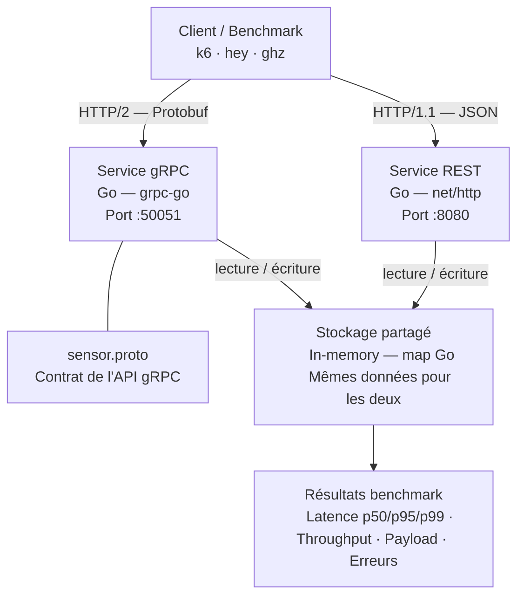

```mermaid
flowchart TD
    CLIENT["Client / Benchmark
    k6 · hey · ghz"]

    CLIENT -->|HTTP/1.1 — JSON| REST
    CLIENT -->|HTTP/2 — Protobuf| GRPC

    REST["Service REST
    Go — net/http
    Port :8080"]

    GRPC["Service gRPC
    Go — grpc-go
    Port :50051"]

    PROTO["sensor.proto
    Contrat de l'API gRPC"]
    GRPC --- PROTO

    REST -->|lecture / écriture| STORE
    GRPC -->|lecture / écriture| STORE

    STORE["Stockage partagé
    In-memory — map Go
    Mêmes données pour les deux"]

    STORE --> RESULTS["Résultats benchmark
    Latence p50/p95/p99 · Throughput · Payload · Erreurs"]
```
